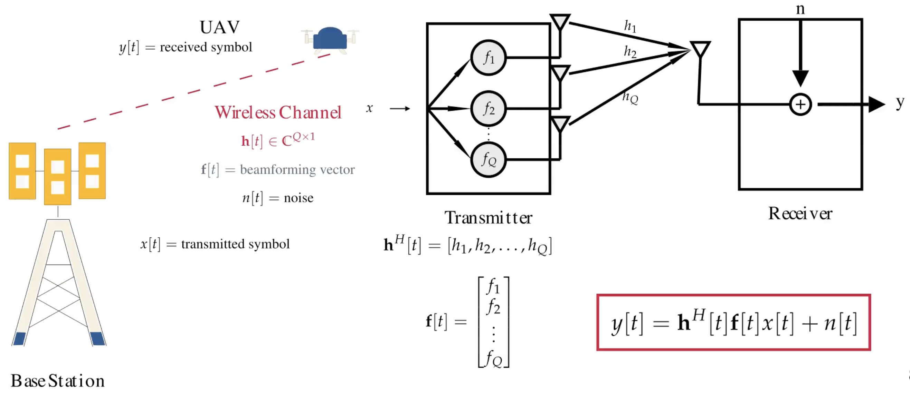

[[Read the English version here](https://medium.com/@ardiantovn/an-overview-of-gps-assisted-beam-prediction-and-tracking-for-uav-mmwave-communication-85a00c13be8b)].
Artikel ini menyajikan versi singkat (TL;DR) dari penelitian saya tentang prediksi dan pelacakan *beam* berbantuan GPS untuk komunikasi dengan *UAV* pada pita frekuensi *mmWave*. Bagi pembaca yang tertarik untuk mengeksplorasi detail implementasi, kode lengkap dapat diakses melalui [repositori github](https://github.com/ardiantovn/gpsbeam) ini.

## Latar Belakang Penelitian

*Unmanned Aerial Vehicles* (UAV) diharapkan berfungsi sebagai *user equipment* (UE) dalam jaringan seluler [1]. Implementasi teknologi *millimeter wave* (*mmWave*) dalam koneksi seluler UAV dapat mendukung laju data tinggi dan memungkinkan berbagai aplikasi seperti pemantauan udara dan operasi tanggap darurat [2]. Karakteristik *path loss* yang signifikan dari *mmWave* mengharuskan implementasi *antenna array* besar di *base station* (BS), yang mengkompensasi kerugian ini dengan menghasilkan *beam* terfokus dengan kemampuan *beamforming* yang ditingkatkan [3]. Akibatnya, manajemen *beam* yang efektif—termasuk proses pelatihan dan pelacakan—sangat penting untuk komunikasi *mmWave* agar dapat dengan cepat membangun *beam* optimal selama pergerakan di dalam dan antar sel, meminimalkan masalah keselarasan *beam* [4]. Selain itu, mobilitas tinggi UAV menciptakan fluktuasi dalam parameter pergerakan seperti kecepatan dan percepatan, yang memerlukan solusi manajemen *beam* khusus yang dirancang khusus untuk platform udara [5]. Situasi ini menekankan perlunya pendekatan kreatif untuk mengatasi tantangan ini dan membangun komunikasi *mmWave* yang andal dan berkinerja tinggi untuk UAV.

## Model Sistem

Penelitian ini mempertimbangkan BS dengan $Q$ antena dan UAV dengan satu antena (lihat Gambar 1). BS mengirimkan simbol $x[t]$ dan simbol yang diterima di UAV $y[t]$ bergantung pada koefisien saluran nirkabel $h[t]$, vektor *beamforming* $f[t]$, dan noise $n[t]$.

*Gambar 1: Model Sistem*

Konfigurasi vektor *beamforming* menentukan arah yang dihadapi *beam* dan seberapa lebar/sempitnya (lihat Gambar 2). Konfigurasi ini disimpan dalam *beam codebook* dengan ukuran $M$. Mengingat informasi posisi historis UAV $O$, penelitian ini bertujuan untuk memanfaatkannya untuk memilih indeks *beam* optimal dalam *beam codebook* menggunakan model pembelajaran mendalam prediksi dan pelacakan *beam* $f(\Theta_{bpt})$. Model ini mengembalikan indeks *beam* saat ini dan tiga indeks *beam* masa depan.

*Gambar 2: Formulasi Permasalahan*

## Solusi yang Diusulkan

Untuk mengatasi tantangan manajemen *beam* untuk komunikasi *mmWave* UAV, pendekatan prediksi *beam* berbantuan GPS yang diusulkan (lihat Gambar 3) memanfaatkan data lokasi historis UE untuk memprediksi indeks *beam* saat ini dan tiga indeks *beam* masa depan.

*Gambar 3: Solusi yang Diusulkan*

Kerangka kerja yang diusulkan terdiri dari dua komponen utama:

1. **Prapemrosesan Data GPS**: Data geodetik (lintang dan bujur) dari UE dan BS, bersama dengan ketinggian penerbangan UE, diterima sebagai input oleh blok prapemrosesan GPS (lihat Gambar 4). Data geodetik UE dan BS dikonversi menjadi koordinat *Earth-Centered Earth-Fixed* (ECEF) oleh blok ini ([6], [7]). Vektor arah yang menunjuk dari BS ke UE diperoleh dengan mengurangi vektor BS dari vektor UE. Vektor ini kemudian dinormalisasi menjadi vektor satuan untuk hanya mewakili arah. Akhirnya, vektor satuan ini digabungkan dengan ketinggian penerbangan UE yang diskala secara logaritmik.

*Gambar 4: Blok Prapemrosesan data GPS*

2. **Model *Deep Learning***: Model *deep learning* (lihat Gambar 5) memproses urutan informasi posisi UE dan BS dan menghasilkan urutan prediksi *beam*. Arsitektur model ini menggabungkan *Convolutional Neural Network* 1-dimensi (1D CNN), *Recurrent Neural Network* (RNN) encoder-decoder [8], dan jaringan *fully connected*. 1D CNN berfungsi sebagai pengekstrak fitur, sementara RNN encoder mengubah urutan input menjadi vektor yang merangkum informasi urutan. Vektor ini kemudian didekode kembali menjadi urutan oleh RNN decoder. Decoder menghasilkan 4 langkah prediksi (*beam* saat ini dan 3 *beam* masa depan). Karena setiap langkah perlu diklasifikasikan ke dalam indeks *beam* tertentu, komponen akhir model adalah lapisan *fully connected*. Untuk setiap langkah prediksi, lapisan ini memetakan keluaran decoder ke salah satu dari 32 kelas *beam*.
Karena ini adalah model klasifikasi, model ini dilatih menggunakan *Cross-Entropy Loss*.

*Gambar 5: Arsitektur Model *Deep Learning**

## Pengaturan Evaluasi

1. Informasi Set Data

Set Data diperoleh dari [Deep Sense 6G Scenario 23](https://www.deepsense6g.net/scenario-23/) [9]. BS dikonfigurasi dengan *phased array* 16 elemen yang beroperasi pada pita 60 GHz dan menggunakan *codebook* dengan 32 *beam* yang telah ditentukan sebelumnya. UE terdiri dari drone yang dikendalikan dari jarak jauh yang dilengkapi dengan pemancar *mmWave* yang beroperasi pada 60 GHz, penerima GPS, dan *inertial measurement units* (IMU).

2. Pembagian Set Data

Set data terdiri dari 11.387 sampel, yang dibagi menjadi set pelatihan, validasi, dan pengujian dengan rasio masing-masing 65%, 15%, dan 20%. Pendekatan umum untuk pembagian set data melibatkan pembagian berurutan (lihat Gambar 6). Namun, metode ini menghasilkan distribusi label yang tidak seimbang; misalnya, label ke-0 tidak memiliki sampel dalam set data pelatihan. Ketidakseimbangan ini menciptakan masalah karena model tidak dapat mempelajari pola yang terkait dengan label yang hilang.

*Gambar 6: Pembagian Set Data Berurutan*

Penelitian ini mengimplementasikan metode pembagian alternatif dengan memecah set data dan menyesuaikan distribusi label (lihat Gambar 7 dan 8). Strategi pembagian dimulai dengan membuat beberapa bongkah (*chunk*) dari set data mentah. Setiap bongkahan berisi bagian yang dialokasikan untuk pelatihan, validasi, dan pengujian. Bagian-bagian ini kemudian dikelompokkan berdasarkan tujuan masing-masing (pelatihan, validasi, atau pengujian).

*Gambar 7: Pembagian Set Data Berbongkah*

Dampak dari pendekatan ini, label ke-0 sekarang memiliki beberapa sampel dalam set data pelatihan. Namun, komposisi pelatihan-validasi-pengujian tetap tidak konsisten di berbagai label. Misalnya, label ke-2 berisi lebih banyak sampel dalam set data validasi daripada dalam set data pengujian, sementara label ke-4 menunjukkan lebih sedikit sampel dalam set data validasi dibandingkan dengan set data pengujian. Untuk mengatasi ketidakkonsistenan ini, jumlah sampel dalam setiap label disesuaikan sesuai dengan rasio pelatihan-validasi-pengujian yang diinginkan, memastikan distribusi sampel yang konsisten di semua label (lihat Gambar 8).

*Gambar 8: Pembagian Set Data yang Disesuaikan*

3. Transformasi Set Data

Karena ini adalah model pembelajaran terawasi (*supervised learning model*), set data harus ditransformasikan menjadi pasangan contoh input dan label keluaran yang sesuai (lihat Gambar 9). Input terdiri dari informasi historis tentang posisi UE dan BS, sementara keluaran terdiri dari indeks *beam* saat ini dan tiga indeks *beam* masa depan. Dalam penelitian ini, semua input dan keluaran dipastikan memiliki indeks urutan $q$ yang sama (indeks $q$ mengelompokkan semua sampel data yang dikumpulkan selama satu lintasan UE saat bergerak melewati BS). Ketika kondisi ini tidak dapat dipenuhi, model menggunakan setidaknya informasi posisi saat ini/ posisi terbaru, dengan data historis yang hilang diisi dengan nilai nol.

*Gambar 9: Transformasi Set Data*

4. Hiperparameter Pelatihan

Proses pelatihan model menggunakan hiperparameter berikut: 20 *epoch* untuk siklus pelatihan lengkap, *batch size* 8 untuk data pelatihan, dan *batch size* yang lebih besar yaitu 1024 untuk validasi dan pengujian. *Optimizer* Adam digunakan dengan *learning rate* awal 5e-4 dan tanpa *weight decay*. *Learning rate* dikurangi dengan faktor 0,1 pada *epoch* 12 dan 18.

## Kinerja Model

Secara keseluruhan, model menunjukkan kinerja yang kuat dengan akurasi Top-1 secara konsisten melebihi 71% dan akurasi Top-3 melebihi 95% di semua langkah prediksi *beam* (lihat Gambar 10). Kinerja ini mewakili peningkatan dibandingkan model dasar yang disajikan dalam [10]. Selain itu, *power loss* rata-rata Top-1 tetap di bawah 0,85 dB di semua langkah prediksi, menunjukkan bahwa bahkan ketika prediksi Top-1 tidak tepat, *power loss* yang dihasilkan kurang dari 20%.

*Gambar 10: Hasil Keseluruhan*

Salah satu daktor yang meningkatkan kinerja model adalah metodologi prapemrosesan yang diimplementasikan. Seperti yang diilustrasikan dalam tabel pada Gambar 10, mengubah input dari ketinggian penerbangan mentah ($H_{UE}$) menjadi ketinggian penerbangan yang diskala secara logaritmik ($H_{UE,ln}$) menghasilkan peningkatan yang signifikan, termasuk peningkatan akurasi dan pengurangan *power loss* rata-rata di semua langkah prediksi.

*Gambar 11: Dampak Pembagian Set Data pada Kinerja Model*

Penelitian ini lebih lanjut mengevaluasi dampak metode pembagian set data dengan membandingkan pendekatan pembagian set data berurutan dan yang disesuaikan. Gambar 11 menunjukkan bahwa melatih model menggunakan metode pembagian yang disesuaikan meningkatkan akurasi model sekitar 20%~25% dan mengurangi *power loss* rata-rata sekitar 25%~28% untuk prediksi hingga *beam* masa depan ke-2.

Dalam hal pengurangan *overhead* pelatihan *beam* [11], model menunjukkan efisiensi yang menjanjikan dengan berpotensi mengurangi persyaratan pelatihan hingga 94% (hanya membutuhkan 1-2 *beam* dibandingkan dengan pelatihan 32 *beam* penuh) sambil bertujuan untuk mempertahankan ambang keandalan akurasi 80% (lihat Gambar 12).
Selain itu, keandalan rerata kehilangan daya model menunjukkan bahwa 93,4% hingga 96,0% dari prediksi Top-1 menghasilkan kehilangan daya 1 dB atau kurang.

*Gambar 12: Penghematan Beban Pelatihan Beam dan Keandalan Rerata Kehilangan Daya*

## Kesimpulan

Penelitian ini menunjukkan bahwa prediksi dan pelacakan *beam* berbantuan GPS yang diusulkan untuk komunikasi *mmWave* UAV memberikan kinerja yang konsisten dengan akurasi Top-1 melebihi 71% dan mempertahankan *power loss* rata-rata di bawah 1 dB di semua horizon prediksi. Solusi ini secara signifikan meminimalkan *overhead* pelatihan *beam* sebesar 90%, sambil tetap memastikan akurasi pemilihan *beam* 95% dengan hanya menggunakan 3-4 *beam* dari *codebook* 32-*beam* lengkap.

## Referensi

[1] Zeng, Yongs, Qingqing Wu, dan Rui Zhang. "Accessing from the sky: A tutorial on UAV communications for 5G and beyond." Proceedings of the IEEE 107.12 (2019): 2327-2375.

[2] Xiao, Zhenyu, et al. "A survey on millimeter-wave beamforming enabled UAV communications and networking." IEEE Communications Surveys & Tutorials 24.1 (2021): 557-610.

[3] Geraci, Giovanni, et al. "What will the future of UAV cellular communications be? A flight from 5G to 6G." IEEE communications surveys & tutorials 24.3 (2022): 1304-1335.

[4] Xue, Qing, et al. "A survey of beam management for mmWave and THz communications towards 6G." IEEE Communications Surveys & Tutorials 26.3 (2024): 1520-1559.

[5] Zhang, Chiya, et al. "Research challenges and opportunities of UAV millimeter-wave communications." IEEE Wireless Communications 26.1 (2019): 58-62.

[6] Paul, M. K. "A note on computation of geodetic coordinates from geocentric (Cartesian) coordinates." Bulletin Géodésique (1946-1975) 108.1 (1973): 135-139.

[7] Zhu, Jijie. "Conversion of Earth-centered Earth-fixed coordinates to geodetic coordinates." IEEE transactions on aerospace and electronic systems 30.3 (1994): 957-961.

[8] Cho, Kyunghyun, et al. "Learning phrase representations using RNN encoder-decoder for statistical machine translation." arXiv preprint arXiv:1406.1078 (2014).

[9] Alkhateeb, Ahmed, et al. "DeepSense 6G: A large-scale real-world multi-modal sensing and communication dataset." IEEE Communications Magazine 61.9 (2023): 122-128.

[10] Charan, Gouranga, dan Ahmed Alkhateeb. "Sensing-Aided 6G Drone Communications: Real-World Datasets and Demonstration." arXiv preprint arXiv:2412.04734 (2024).

[11] Morais, João, et al. "Position-aided beam prediction in the real world: How useful GPS locations actually are?." ICC 2023-IEEE International Conference on Communications. IEEE, 2023. 